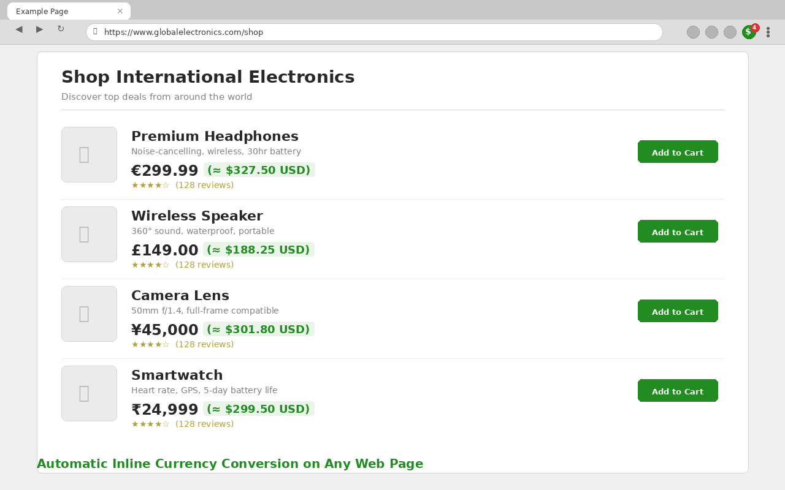
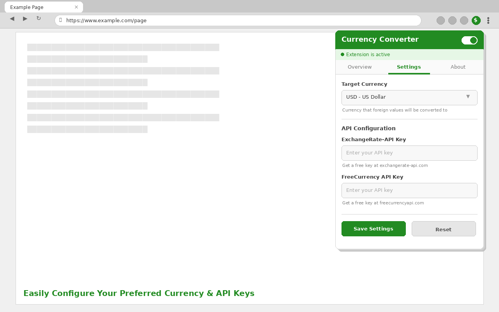
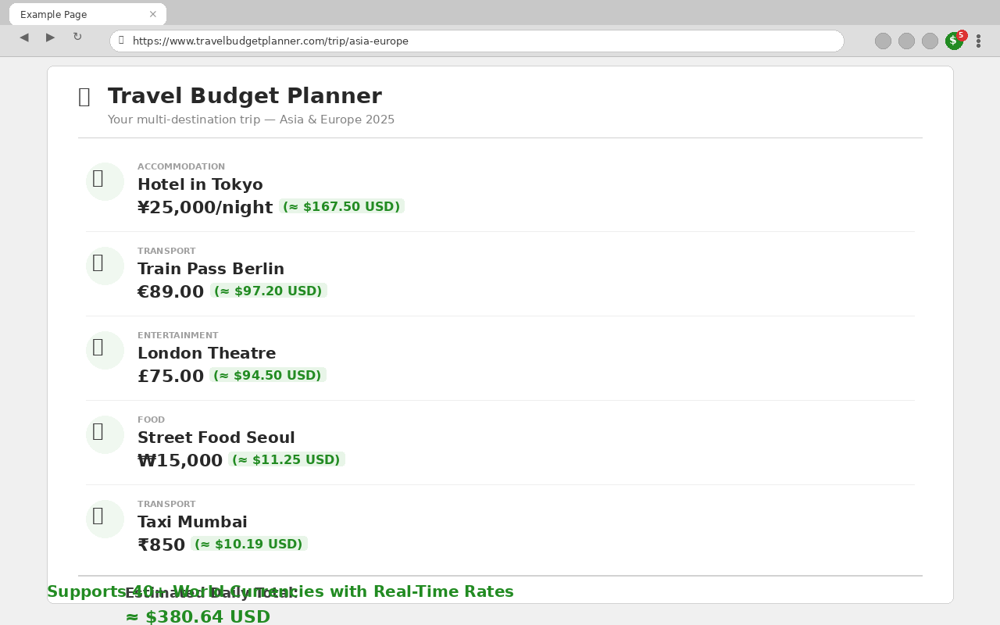

# Currency Converter Browser Extension

A browser extension that automatically detects and converts currency values on web pages to your preferred target currency using reliable exchange rate APIs.

## Features

**Version**: 1.3.0 | **Compatibility**: Chrome, Edge (Manifest V3)

- **Automatic Detection**: Scans web pages for currency values and symbols
- **Real-time Conversion**: Converts currencies using multiple reliable APIs
- **Customizable Target**: Choose from 21 popular target currencies
- **API Key Support**: Optional premium API keys for enhanced reliability
- **Fast & Lightweight**: Minimal performance impact
- **Clean Interface**: Unobtrusive inline conversion display
- **Statistics**: Monitor conversions and detected currencies
- **Multiple API Fallbacks**: Ensures high availability

## Supported Currencies

The extension automatically detects and converts from these currencies:

| Symbol | Currency | Code |
|--------|----------|------|
| $ | US Dollar | USD |
| € | Euro | EUR |
| £ | British Pound | GBP |
| ¥ | Japanese Yen | JPY |
| ₹ | Indian Rupee | INR |
| ₩ | South Korean Won | KRW |
| ₽ | Russian Ruble | RUB |
| And 20+ more... | | |

## Installation

### From Chrome Web Store
1. Visit the [Chrome Web Store page](https://chromewebstore.google.com/) (pending review)

### Manual Installation (Developer Mode)
1. Download or clone this repository
2. Open Chrome and navigate to `chrome://extensions/`
3. Enable "Developer mode" in the top right
4. Click "Load unpacked" and select the extension folder
5. The extension icon should appear in your toolbar

## Usage

### Basic Usage
1. **Automatic Detection**: Simply browse any website with currency values
2. **View Conversions**: Currency conversions appear inline next to original values
3. **Toggle On/Off**: Click the extension icon to enable/disable conversion
4. **Change Target Currency**: Access settings to choose your preferred currency

### Advanced Configuration
1. **API Keys**: Add your own API keys for enhanced reliability
   - [ExchangeRate-API](https://www.exchangerate-api.com/) (Free tier available)
   - [FreeCurrency API](https://freecurrencyapi.com/) (Free tier available)
2. **Rescan Pages**: Force rescan of current page for new currencies
3. **Statistics**: Monitor conversion activity and detected currencies

## API Sources

The extension uses multiple API sources with fallback support:

1. **ExchangeRate-API** (with API key)
2. **Fawazahmed0 Currency API** (free)
3. **Currency API Fallback** (free)
4. **FreeCurrency API** (with API key)
5. **Open Exchange Rates Backup** (free)

## Screenshots

> *Extension popup showing conversion statistics and detected currencies*
> 

> *Inline currency conversions on a shopping page*
> 

> *Settings tab with target currency and API key configuration*
> 

> *Multiple currencies converted on a travel planning page*
> 

## Contributing

Contributions are appreciated!

### Ways to Contribute
- Report bugs and issues
- Suggest new features
- Submit code improvements

## License

This project is licensed under the **GNU Affero General Public License v3.0 (AGPL-3.0)**.

This means you can:
- Use the software freely
- Modify the source code
- Distribute copies
- Distribute modified versions

With the requirements:
- Include the license and copyright notice
- State significant changes made
- Make source code available for network use
- Use the same license for derivatives

See [LICENSE](LICENSE) for the complete license text.

## Privacy

This extension:
- Does not collect personal data
- Only makes API calls for currency conversion
- Stores settings locally in browser
- Does not track user activity
- Open source for transparency

## Credits & Attribution

### Developer
**[Brad Selph](https://github.com/bradselph)**
- Extension development and maintenance
- GitHub: [github.com/bradselph](https://github.com/bradselph)

### Exchange Rate APIs

**[ExchangeRate-API](https://www.exchangerate-api.com)**
- *"Rates By Exchange Rate API"*
- Provides premium exchange rate data with API key
- Terms: [exchangerate-api.com/terms](https://www.exchangerate-api.com/terms)
- Free tier: 1,500 requests/month

**[Fawazahmed0 Currency API](https://github.com/fawazahmed0/currency-api)**
- Open source currency exchange rates
- No API key required
- License: Public Domain
- CDN: Delivered via jsDelivr

**[FreeCurrency API](https://freecurrencyapi.com) by [EveryAPI](https://github.com/everapihq)**
- Premium currency data service
- GitHub: [github.com/everapihq](https://github.com/everapihq)
- Free tier: 5,000 requests/month
- Terms: [freecurrencyapi.com/terms](https://freecurrencyapi.com/terms)

**[Open Exchange Rates](https://open.er-api.com)**
- Free exchange rate API
- No registration required
- Rate limits apply
- Terms: [open.er-api.com/terms](https://open.er-api.com/terms)

### Icons & Graphics

**[IconArchive.com](https://www.iconarchive.com/)**
- Extension icons sourced from IconArchive

## API Usage & Compliance

### Rate Limits & Fair Use
- **ExchangeRate-API**: 1,500 requests/month (free tier)
- **FreeCurrency API**: 5,000 requests/month (free tier)
- **Fawazahmed0 API**: No explicit limits, fair use expected
- **Open Exchange Rates**: 1,000 requests/month (free tier)

### Attribution Requirements
This extension complies with all API provider attribution requirements:

1. **ExchangeRate-API**: Displays "Rates By Exchange Rate API" attribution
2. **EveryAPI**: Credits FreeCurrency API and EveryAPI organization
3. **Fawazahmed0**: Credits open source project and GitHub repository
4. **Open.er-api.com**: Credits service provider

## Legal Compliance

### Terms of Service Compliance
This extension operates within the terms of service of all integrated APIs:
- Reasonable request volumes
- Proper attribution as required
- No redistribution of raw API data
- Educational and utility use case

## Disclaimer

This extension is provided "as is" without warranty. Exchange rates are provided by third-party services and may not be suitable for trading or financial decisions. Always verify rates with official financial sources for important transactions.

The developer is not affiliated with any of the API providers or financial institutions. All trademarks and service marks are property of their respective owners.